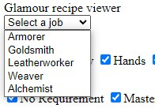
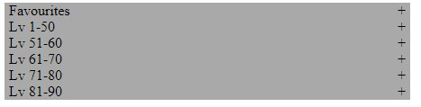
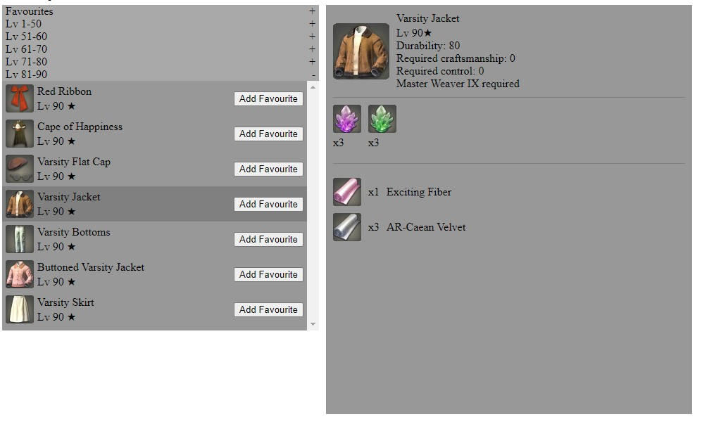

# cb-final-project

A recipe viewer for items that are only used for fashion.

You can select from the Desciple of Hand jobs that have item recipes for fashion glamour.

The recipes are split into the level ranges needed to craft them.

You can select an item from the list and the recipe will display with the details for what is necessary to craft it.

You can filter by both equipment type, and the Master Book required to craft the item
